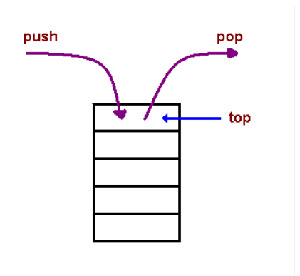

# Reading 

[Understanding the JavaScript Call Stack](https://www.freecodecamp.org/news/understanding-the-javascript-call-stack-861e41ae61d4)

* What is a ‘call’?

The call stack is primarily used for function invocation (call).

* How many ‘calls’ can happen at once?

each time i call the function it happens once

* What does LIFO mean?

Last In, First Out 

* Draw an example of a call stack and the functions that would need to be invoked to generate that call stack.

* What causes a Stack Overflow?

A stack overflow occurs when there is a recursive function (a function that calls itself) without an exit point. 

[JavaScript error messages](https://canvas.instructure.com/courses/4934107/discussion_topics/15122239)

* What is a ‘reference error’?

This is as simple as when you try to use a variable that is not yet declared you get this type os errors.

* What is a ‘syntax error’?

when you have something that cannot be parsed in terms of syntax, like when you try to parse an invalid object using JSON.parse.

* What is a ‘range error’?

Try to manipulate an object with some kind of length and give it an invalid length

* What is a ‘type error’?

Like the name indicates, this types of errors show up when the types (number, string and so on) you are trying to use or access are incompatible, like accessing a property in an undefined type of variable.

* What is a breakpoint?

The breakpoint can also be achieved by putting a debugger statement in your code in the line you want to break.

* What does the word ‘debugger’ do in your code?
To debug your JS code, the easiest and maybe the most common way its to simply console.log()